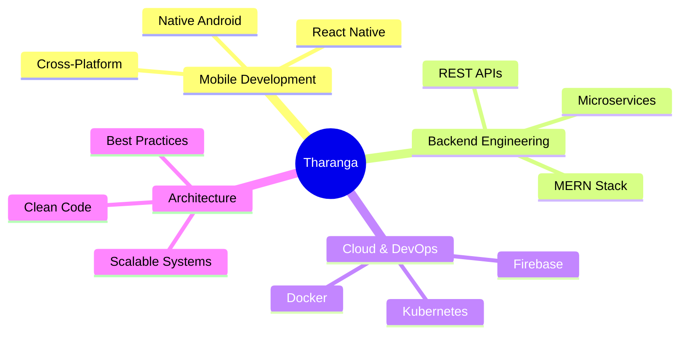

<div align="center">

# 👋 Tharanga

### Software Engineer | Full-Stack Architect | Mobile Innovator

*Crafting elegant solutions through code*

[](https://github.com/TharangaJ123)

</div>

---

## 🎯 About

Detail-oriented software engineering student with a passion for building scalable, high-performance applications. I specialize in architecting robust backend systems and creating seamless cross-platform mobile experiences that users love.

```typescript
const tharanga = {
    location: "Colombo, Sri Lanka 🇱🇰",
    focus: ["Mobile Development", "Full-Stack Architecture", "Cloud Solutions"],
    currentlyLearning: ["Serverless Architectures", "Advanced Mobile Patterns"],
    funFact: "I pursue perfection, knowing it's the journey that matters",
    pronouns: "He/Him/His"
};
```

---

## 💼 Tech Arsenal

<table>
<tr>
<td valign="top" width="33%">

### 📱 Mobile


</td>
<td valign="top" width="33%">

### 🎨 Frontend


</td>
<td valign="top" width="33%">

### ⚙️ Backend


</td>
</tr>
<tr>
<td valign="top" width="33%">

### 🗄️ Database


</td>
<td valign="top" width="33%">

### 🚀 DevOps


</td>
<td valign="top" width="33%">

### 💻 Languages


</td>
</tr>
</table>

---

## 🎯 Core Competencies



---

## 📊 GitHub Analytics

<div align="center">
  


</div>

<div align="center">
  
[](https://github.com/TharangaJ123)

</div>

---

## 🌟 What I'm Up To

- 🔨 **Building:** Advanced mobile applications with cutting-edge features
- 🌱 **Learning:** Serverless architectures and cloud-native development
- 🤝 **Open To:** Collaborating on innovative mobile and web projects
- 💡 **Exploring:** AI integration in mobile applications

---

## 🤝 Let's Connect

<div align="center">

[](mailto:chathuratharanga076@gmail.com)
[](https://github.com/TharangaJ123)

</div>

---

<div align="center">

### 💭 *"Striving for excellence in every line of code"*


</div>
